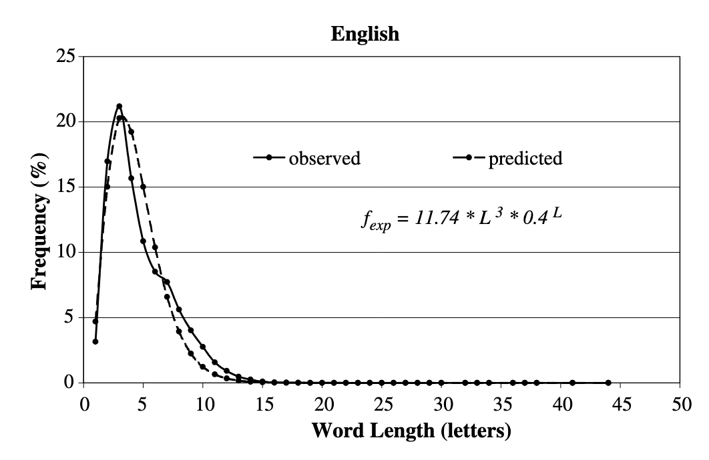

# CS310-Scrabble-Bot

## Methods @author - Qusai Elwazir

### Dictionary  @author - Qusai Elwazir
- For the dictionary we will do some preprossesing on it organize it in a datastructle that is searched using a set of letters and returns all words that contain all of the letters we searched with. For example if the argument [t,h,e] is passed into our search function, it would return [the, het, eth], which are all words according to the scrabble dictionary. The best way to do this kind of searching is with a map data structure.
- To do this we will use prime factorization. The product of any set of prime numbers is unique, that is the prime factorization of any given number is not shared by any other number. We can use this property of prime numbers to give sets of words containing the same sets of numbers unique keys. We can do this by assigning a prime number to each of the 26 letters in the alphabet. For example we would assign (a, 2), (b, 3), (c, 5), (d, 7)... etc.. This means that when we search for the set of all words that are comprised of a, b, and c we will take the product of the prime numbers assigned to a b and c (2 * 3 * 5 = 30) and search our dictionary using that key. This means that searching for a given word will run in the following time with n denoting the number of letters in the word we are searching for: $$O(n!)$$ although this may not look very efficent we have very good bounds for n and k. Words in the english language are simply not very long so our value for n will be on 5 on average (since that is the average length of a word in the english dictionary). This means that on average our search function will run with n = 5 which results in at most 120 operations for searching The longest word in the scrabble dictionary is 15 letters which means our upper bound for our search function runs with n = 15 which would result in at most 1,307,674,368,000 operations. This might look bad but in reality the number of 15 letter words is very small so the probability that we will actually have to do that many searches is exteremly small.  Above is the distribution of words in the english language by length. From *WORD LENGTH, SENTENCE LENGTH AND
FREQUENCY – ZIPF REVISITED* by
Bengt Sigurd, Mats Eeg-Olofsson & Joost van de Weijer. As you can see the distribution is heavily skewed twords words that are shorter in length. Therefore the probibility of doing the maximum number of searches becomes much hihger as n approches 5 from positive infinity and 0. 

- After preprocessing is complete searching for a set of words that are comprised of a set of letters will run in constant time.

- In the same way, this is how we will organize our dictionary. We will iterate through each word in the dictionary on initialization, find the product of the letters assigned prime numbers, and add them to their respective sets in the map. This preprocessing will run in O(n*(average word length)). This is because we must iterate over every word and find the product of its letters and add it to our map.

### Game State Analysis @author Qusai Elwazir
- Scrabble is played on 15x15 tile board. The center of the board is at [7][7]. 
- There are double letter score tiles diagonally around the center at: [6][6], [6][8], [8][6], [8][8]... . 
- There are triple letter score tiles at.. [][]
- There are double word score tiles at... [][]
- There are triple word score tiles at... [][]
- A playable word is a word that contains at least one letter that is already on the board (unless it is the first move), that is, a playable word must overlap with the current games island (blob of words)
- We will represent the board using a 15x15 matrix containing characters, or null values at each index to represent a game state.
- We will adopt a brute force method and check each present letter on the board in all directions to look for legal plays.